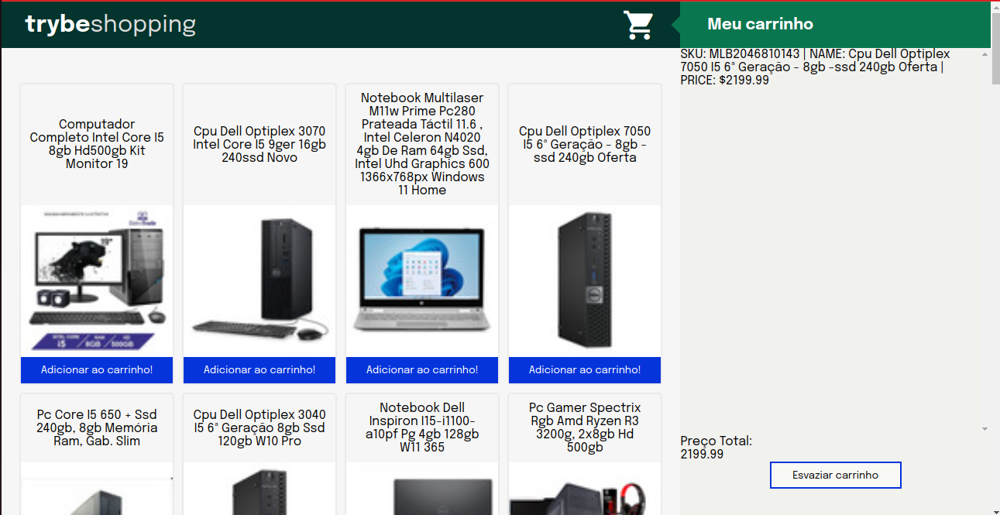

# Projeto 07 - ShoppingCart

Oi. Este foi um dos projetos que eu fiz durante meu curso na Trybe. Confira os detalhes dele abaixo.

## Nome do Projeto
ShoppingCart (Carrinho de Compras)
## Linguagens e Ferramentas Utilizadas

 - JavaScript
 - HTML
 - CSS
 - Leitura de API utilizando JavaScript, com funções assíncronas

## Objetivos do Projeto
Esse foi o primeiro projeto do módulo de *front-end*. Seu intuito foi de colocar em prática os conhecimentos adquiridos asobre consumo de API, e utilização de funções assíncronas (métodos async, await, manipular fetchs, promises, etc.). O projeto tem como estrutura a página de um carrinho de compras. A API consumida retorna vários produtos que são listados, e podem ser adicionados e retirados do carrinho de compras. 

## Instruções para visualização
Comando para clonar o projeto:
 - `git clone git@github.com:BrunoSayago/projeto-07-ShoppingCart.git`
 
Se necessário, instalar as dependências:
 - `npm install`
  
O projeto pode ser visto no navegador utilizando-se alguma extensão, como o live server.  
